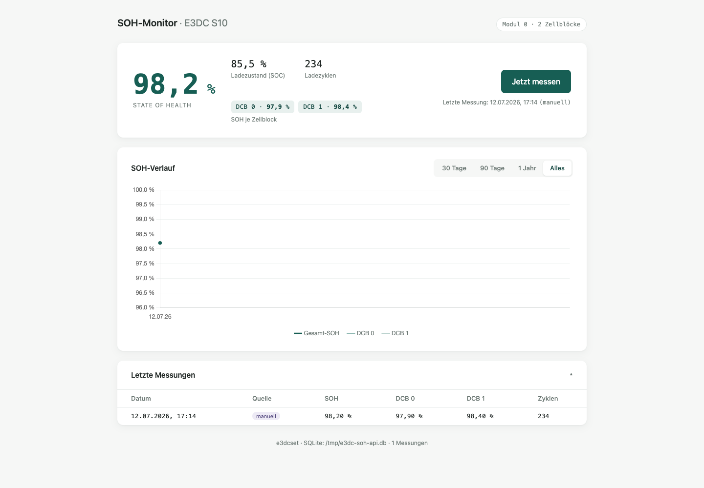

# e3dcset-ui

Lokale Web-App zur Langzeit-Überwachung der Batterie-Gesundheit eines E3DC S10 Hauskraftwerks. Die App nutzt ein bereits installiertes und konfiguriertes [`e3dcset`](https://github.com/mschlappa/e3dcset), speichert jede Messung in SQLite und zeigt den SOH-Verlauf im Browser.



## Installation

Wenn du die App neu einrichtest, nimm das Installationsskript:

```bash
./install.sh
```

Das Skript richtet die Python-Umgebung ein, erstellt bei Bedarf die Konfiguration, kann eine erste Messung testen und optional die systemd-User-Services aktivieren.

Für die manuelle Schritt-für-Schritt-Anleitung:

**[INSTALL.md](INSTALL.md)**

## Features

- Gesamt-SOH über `BAT_ASOC`
- SOH pro DCB-Zellblock über den Modul-Dump `e3dcset -m 0 -j`
- Verlauf als Chart für Gesamt-SOH und alle DCB-Zellblöcke
- Manuelle Messung per Button
- Tägliche automatische Messung per systemd-User-Timer
- Lokale SQLite-Datenbank inklusive komplettem Roh-JSON jeder Messung
- Fehlerprotokollierung: fehlgeschlagene Messungen werden mit `ok=0` gespeichert
- Keine Cloud, keine Authentifizierung, Bind nur an `127.0.0.1`
- Offline-fähiges Frontend: Chart.js ist lokal gebundelt

## Voraussetzungen

- Linux Desktop, Debian/Ubuntu-basiert empfohlen
- Python 3.10+
- `e3dcset` ist installiert und funktioniert lokal
- E3DC S10 ist aus dem lokalen Netz erreichbar
- Optional: `systemd --user` für automatische Messungen

## Kurzinstallation

```bash
cd /opt
sudo git clone https://github.com/mschlappa/e3dcset-ui.git
sudo chown -R "$USER:$USER" e3dcset-ui
cd e3dcset-ui

./install.sh
```

## Konfiguration

Die App liest Umgebungsvariablen. Für systemd liegt die optionale Environment-Datei hier:

```bash
mkdir -p ~/.config/e3dc-soh-monitor
nano ~/.config/e3dc-soh-monitor/env
```

Beispiel:

```ini
E3DCSET_BIN=/usr/local/bin/e3dcset
E3DCSET_CONFIG=/etc/e3dcset/e3dcset.config
E3DCSET_ARGS=
E3DC_BATTERY_MODULE=0
E3DC_SOH_PORT=8321
```

`E3DCSET_CONFIG` ist optional. Wenn `e3dcset` seine Config selbst findet, kann die Variable leer bleiben.

## Erste Messung testen

```bash
cd /opt/e3dcset-ui
. .venv/bin/activate
python measure.py --source manual
```

Bei Erfolg entsteht die Datenbank unter:

```text
~/.local/share/e3dc-soh-monitor/soh.db
```

Bei einem Fehler crasht die App nicht. Stattdessen wird eine Messung mit `ok=0` und Fehlertext gespeichert.

## Web-App starten

```bash
cd /opt/e3dcset-ui
. .venv/bin/activate
uvicorn app:app --host 127.0.0.1 --port 8321
```

Dann im Browser öffnen:

```text
http://127.0.0.1:8321
```

## Automatische Messung mit systemd

```bash
mkdir -p ~/.config/systemd/user
cp systemd/e3dc-soh-measure.service ~/.config/systemd/user/
cp systemd/e3dc-soh-measure.timer ~/.config/systemd/user/
cp systemd/e3dc-soh-web.service ~/.config/systemd/user/

systemctl --user daemon-reload
systemctl --user enable --now e3dc-soh-measure.timer
systemctl --user enable --now e3dc-soh-web.service
```

Timer prüfen:

```bash
systemctl --user list-timers e3dc-soh-measure.timer
journalctl --user -u e3dc-soh-measure.service -n 100 --no-pager
```

Wenn die Messung auch ohne aktive Desktop-Session laufen soll:

```bash
loginctl enable-linger "$USER"
```

## API

- `GET /api/health`
- `GET /api/latest`
- `GET /api/history?from=YYYY-MM-DD&to=YYYY-MM-DD`
- `GET /api/recent`
- `POST /api/measure`

Alle Endpunkte liefern JSON. Die App ist absichtlich nur für localhost gedacht.

## Entwicklung mit Fake-Daten

Für UI-Tests ohne E3DC:

```bash
cd /opt/e3dcset-ui
E3DCSET_BIN=$PWD/tests/fake-e3dcset \
E3DC_SOH_DB=/tmp/e3dc-soh-api.db \
.venv/bin/python -m uvicorn app:app --host 127.0.0.1 --port 8321
```

Das Fake-Binary gibt einen Modul-Dump mit zwei DCB-Zellblöcken zurück.
